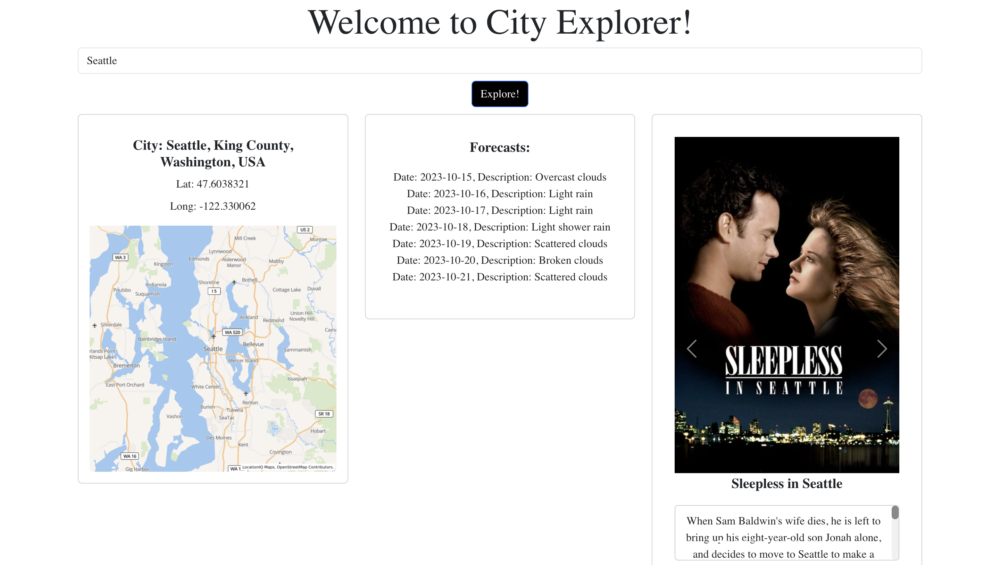
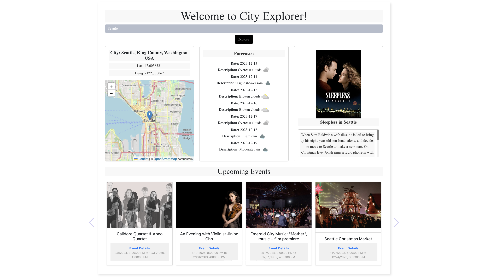
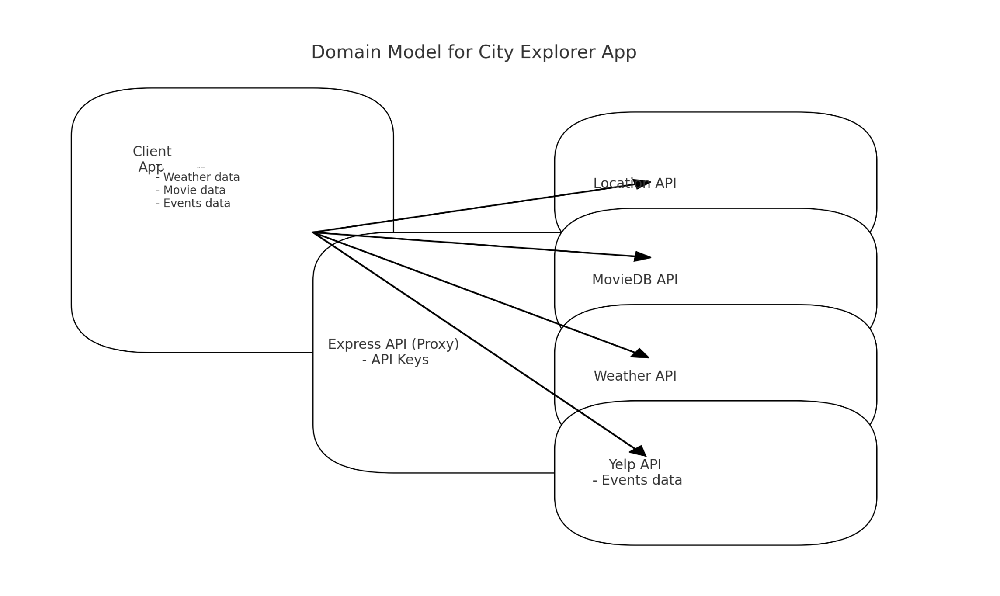

# City Explorer

City Explorer is an engaging web application that enhances urban exploration with real-time information. It provides detailed maps, current weather forecasts, a curated selection of movies, and popular events in the city. Built with React.js and Bootstrap, and supported by Express.js, City Explorer brings city exploration to life.

## Live Demo

Experience City Explorer in action: [Live Demo on Netlify](https://city-explorer-kat.netlify.app/)

## Version

The application is currently at version 1.1, featuring Yelp API integration for events.

- Version 1


- Version 1.1


## Features

- **Interactive City Maps**: Navigate through detailed maps for insights into city layouts.
- **Live Weather Updates**: Get up-to-date weather forecasts for your city of interest.
- **City-Inspired Movie Carousel**: Discover films related to the city you're exploring.
- **Popular Local Events**: Find out about the most popular events happening in the city, powered by the Yelp API.
- **User-Friendly Design**: Engage with an intuitive interface designed for ease of navigation and interaction.

## Usage Limitations

Please note that City Explorer has a limitation of 50 weather API requests per 24 hours. If you encounter issues with the application not working as expected, it may be due to reaching this limit. I recommend waiting until the 24-hour period has passed or consider upgrading your API plan if you require more frequent access to weather and movie data.

## Installation

Get started with City Explorer using the following steps:

1. **Clone the Repository**:
   ```bash
   git clone https://github.com/KatKho/city-explorer.git
   ```

2. **Navigate to the Project Directory**:
   ```bash
   cd city-explorer
   ```

3. **Install Dependencies**:
   ```bash
   npm install
   ```

4. **Environment Configuration**:
   - Create a `.env` file in the project root.
   - Add the following environment variables:
     ```
     VITE_LOCATIONIQ_API_KEY=your_locationiq_api_key_here
     VITE_EXPRESS_SERVER_URL=your_express_server_url_here
     ```

5. **Run the App**:
   ```bash
   npm start
   ```

## Domain Modeling



## Technology Stack

- **React.js**: A robust front-end library for building user interfaces.
- **Bootstrap**: For responsive and attractive UI components.
- **Express.js**: Back-end framework for handling API requests.

## App Structure

Here's a quick overview of the main components:

- **Maps**: Displays detailed maps of cities.
- **Weather**: Shows current weather information.
- **Movies**: Carousel of movies related to the city.
- **Events**: Information on popular local events sourced from Yelp.

## Contact

For any inquiries or contributions, feel free to contact:

- [Ekaterina Khoroshilova](https://www.linkedin.com/in/ekaterina-khoroshilova)
