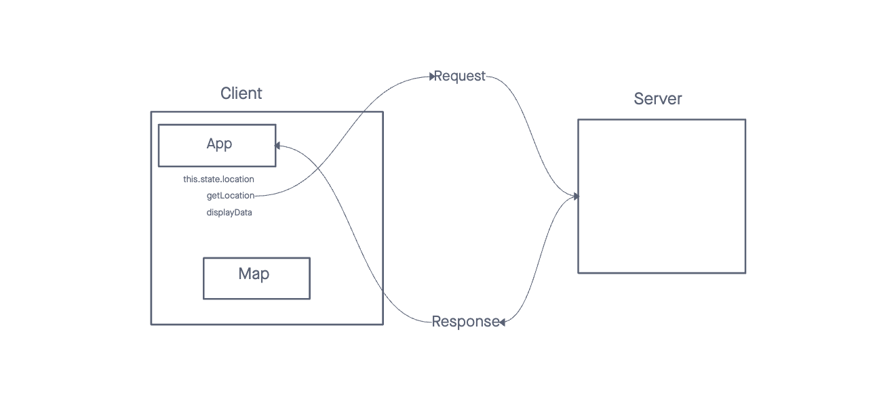

# CITY_EXPLORER

A React application that uses the Axios library to make user-initiated requests for data from a third-party API.

[Deployed link](https://city-explorer-kat.netlify.app/)

## Getting Started

Name of feature: City-explorer

Estimate of time needed to complete: 2hrs

Start time: 2:14 pm

Finish time: 4:09 pm

Actual time needed to complete: 1 hr 55 min

### Requirements

For development, you will only need Node.js installed on your environment.
And please use the appropriate [Editorconfig](http://editorconfig.org/) plugin for your Editor (not mandatory).

#### Node

[Node](http://nodejs.org/) is really easy to install & now include [NPM](https://npmjs.org/).
You should be able to run the following command after the installation procedure
below.

    $ node --version
    v0.10.24

    $ npm --version
    1.3.21

### Install

    git clone https://github.com/ORG/PROJECT.git
    cd PROJECT
    npm install

### Configure app

Any environment configuration steps.

### Start & watch

    npm run dev
    npm start

### Simple build for production

    npm run build

**Author**: Ekaterina Khoroshilova
**Version**: 1.0.0 (increment the patch/fix version number if you make more commits past your first submission)

## Overview
<!-- Provide a high level overview of what this application is and why you are building it, beyond the fact that it's an assignment for this class. (i.e. What's your problem domain?) -->

## Architecture

## Change Log
<!-- Use this area to document the iterative changes made to your application as each feature is successfully implemented. Use time stamps. Here's an example:

01-01-2001 4:59pm - Application now has a fully-functional express server, with a GET route for the location resource. -->

## Credit and Collaborations
<!-- Give credit (and a link) to other people or resources that helped you build this application. -->
